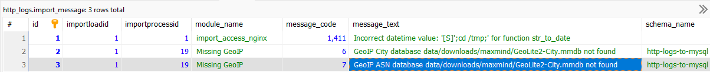

## Installation Instructions
Steps make installation quick and straightforward. Application will be ready to import HTTP logs on completion.

### Import Message Table - first place to look when in doubt about anything

This table is helpful information when learning the App. The message data is raw and will be refined in future.

During installation and execution Python & MySQL write all messages, warnings and errors to MySQL schema `import_message` TABLE. 

Screenshot shows 3 records inserted running repository without downloading GeoIP database first. 

The 2 Python records are about missing databases. The 1 MySQL record is about NGINX data problem.

The `module_name`, `importloadid` and `importprocessid` columns tells where message originated.



### 1. Python
Install all required packages (`requirements.txt` in repository):
```
pip install -r requirements.txt
```
### 2. Database
Before running `create_http_logs.sql` if User Account `root`@`localhost` does not exist on installation server open 
file and perform a ***Find and Replace*** using a User Account with DBA Role on installation server. Copy below:
```
root`@`localhost`
```
Rename above <sup>user</sup> to a <sup>user</sup> on your server. For example - `root`@`localhost` to `dbadmin`@`localhost`

The easiest way to install is use database Command Line Client. Login as User with DBA Role and execute the following:
```
source path/create_http_logs.sql
```
Only MySQL server must be configured in `my.ini`, `mysqld.cnf` or `my.cnf` depending on platform with following: 
```
[mysqld]
local-infile=1
```
### 3. Create database USER & GRANTS
To minimize data exposure and breach risks create a database USER for Python module with GRANTS to only schema objects and privileges required to execute import processes. Replace hostname from `localhost` to hostname of installed database if different. (`mysql_user_and_grants.sql` in repository)
### 4. Run Application

Run `files_watch.py` then add file or files to a configured folder and `main:process_files` will process ONLY the added files. 

Run `files_import.py` and `main:process_files` executes `config.json` Processes for status = 'Active' which will ingest all unprocessed files in all configured folders.

Next time `files_import.py` is run only new files since last run will be processed. It knows what files have been imported.

If issues occur check MySQL schema `import_message` TABLE. All messages INSERT unless Database Function Permissions problem.

The GeoIP databases are not included in repository. Links to download GeoLite2 and Geo-IP databases are in Data Enrichments section. Both are easy to download and free.
## Visual Interface App
in my development queue [MySQL2ApacheECharts](https://github.com/willthefarmer/mysql-to-apache-echarts) is a ***visualization tool*** for the database schema. The Web interface consists of [Express](https://github.com/expressjs/express) web application frameworks with [W2UI](https://github.com/vitmalina/w2ui) drill-down data grids for Data Point Details.
